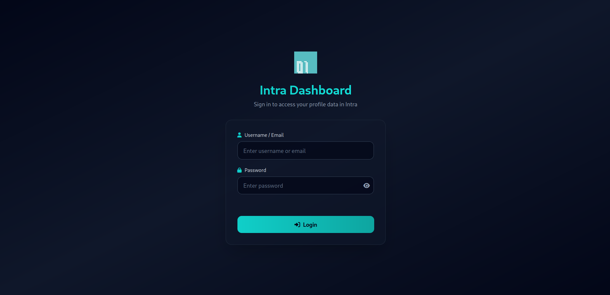

# Intra-Dashboard

A modern, interactive profile dashboard built with vanilla JavaScript and GraphQL, featuring real-time data visualization and authentication.

##  Live Demo

**Deployed at:** [intraa-dashboard.netlify.app](https://intraa-dashboard.netlify.app)



## ✨ Features

- **JWT Authentication** - Secure login with Bearer token
- **User Profile Display** - Shows comprehensive user information with gender-based avatars
- **Interactive XP Progress Chart** - SVG-based line chart with hover tooltips showing transaction details
- **Audit Ratio Visualization** - Stacked bar chart displaying done/bonus/received audits
- **Real-time Data** - Fetches data from GraphQL API
- **Responsive Design** - Mobile-friendly interface with Tailwind CSS
- **Modern UI** - Custom color scheme (#10CFC9) with gradient effects

## 🛠️ Technologies

- **Frontend:** Vanilla JavaScript (ES6 Modules)
- **Styling:** Tailwind CSS
- **Icons:** Font Awesome
- **API:** Intra Graphiql
- **Charts:** Custom SVG rendering (no external libraries)
- **Authentication:** JWT with localStorage

## 🚀 Running Locally

```bash
# Run the Go server
go run main.go
```

Then open your browser and navigate to:
```
http://localhost:5050
```

## 📁 Project Structure

```
intra-dashboard/
├── index.html              # Login page
├── profile.html            # Profile dashboard
├── main.go                 # Go server (alternative)
├── assets/
│   ├── logo.png           # Application logo
│   ├── main-page.png      # Dashboard screenshot
│   ├── male.png           # Male avatar
│   └── female.png         # Female avatar
├── js/
│   ├── app.js             # Routing and authentication guard
│   ├── auth.js            # JWT authentication logic
│   ├── login.js           # Login form handler
│   ├── profile.js         # Profile page data loader
│   ├── queries.js         # GraphQL queries
│   ├── templates.js       # UI rendering functions
│   ├── graphs.js          # Chart rendering (SVG)
│   └── utils.js           # Helper functions
└── README.md
```

## 📄 License

This project is part of the Reboot01 curriculum.

---

**Built with ❤️ for Reboot Talent**